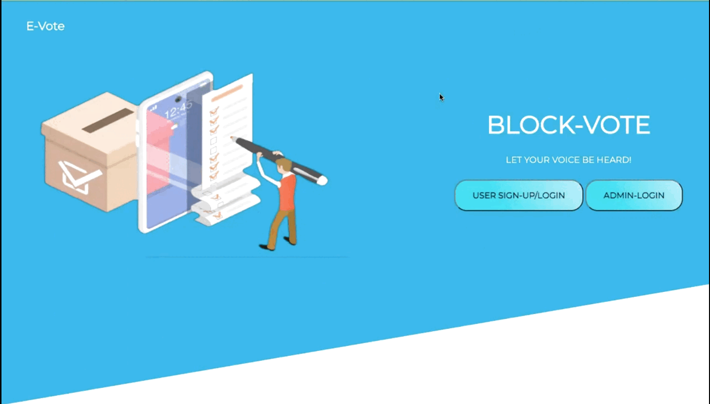

##  BlockVote – Decentralized Voting System

## A transparent, secure, and tamper-proof digital voting platform powered by blockchain.##

### **Project Demo**

> **

---

## About the Project

BlockVote is a **digital voting system** that removes the need for physical ballots or trusting third-party voting platforms. Instead, it uses **blockchain technology** to make voting:

* **Completely transparent** (no manipulation)
* **Secure** (every vote is verified and logged immutably)
* **Accessible** (voters can vote online with Aadhaar + Metamask)

This system helps ensure that elections are **fair**, **fraud-free**, and **openly auditable**, without compromising voter privacy.

---

## Technical Overview

BlockVote is built as a **full-stack decentralized application (dApp)** where:

* Voters register using their **Aadhaar number and wallet**
* All transactions (voter registration, candidate addition, votes) are recorded via **smart contracts on Ethereum**
* Admins manage election phases and candidates via **metamask-authenticated actions**
* Results are generated in real time from the blockchain

The system ensures **end-to-end security, role-based access**, and **decentralized trust**.

---

## Features

### Landing Page

* User login/signup
* Admin login

---

### Voter Dashboard

1. **Voter Manual** – Learn how to use the platform
2. **Voter Registration** – Submit Aadhaar + Metamask address
   ⮕ Email OTP + Wallet Connect
3. **Cast Vote** – Secure vote submission via Metamask
4. **View Results** – Real-time blockchain results
5. **Logout**

---

### Admin Dashboard

1. **Candidate Registration** – Name, party, qualification, age
   ⮕ Saved via blockchain transaction
2. **Candidate List** – View all registered candidates
3. **Voter Approval** – Register verified voters via Metamask
4. **Change Phase** – Toggle between:

   * Registration
   * Voting Open
   * Voting Closed
5. **Logout**

---

## Architecture 

### User Perspective

* User signs up and links Aadhaar + Wallet
* Receives email verification
* Registers and casts vote via blockchain
* Can view real-time results

---

### Admin Perspective

* Admin logs in
* Registers candidates and voters via Metamask
* Controls voting phases (open/close)
* All actions are logged immutably on-chain

---

## Tech Stack Used

| Layer      | Tech Used                    | Purpose                         |
| ---------- | ---------------------------- | ------------------------------- |
| Frontend   | HTML, CSS, JS, EJS           | UI and templating               |
| Backend    | Node.js + Express            | API, routing, logic             |
| Blockchain | Solidity + Truffle + Ganache | Smart contracts + local testnet |
| Wallet     | MetaMask + Web3.js           | Blockchain interaction          |
| Database   | MySQL                        | Persistent user + meta data     |
| Email      | SMTP (Nodemailer)            | Email verification              |

---

## How It Works

1. **Voter Signup**: Registers with Aadhaar + Wallet → Verifies email
2. **Metamask Connect**: Every action (vote, registration) signed via wallet
3. **Smart Contracts**: Candidate & vote logic stored on-chain
4. **Phase Control**: Admin can open/close voting periods securely
5. **Tamper-Proof Results**: Data fetched directly from blockchain, no manual changes possible

---

## Conclusion

BlockVote is designed to **modernize voting** with complete transparency and decentralized trust. It eliminates fraud, enhances voter accessibility, and proves the power of **blockchain in public systems**. This is not just a project — it's a step toward the future of democratic participation.

---

## License

This project is licensed under the **[MIT License](./LICENSE)** .

---

## Contributions

Contributions, issues, and feature requests are welcome!
Please feel free to submit a pull request or open an issue.

